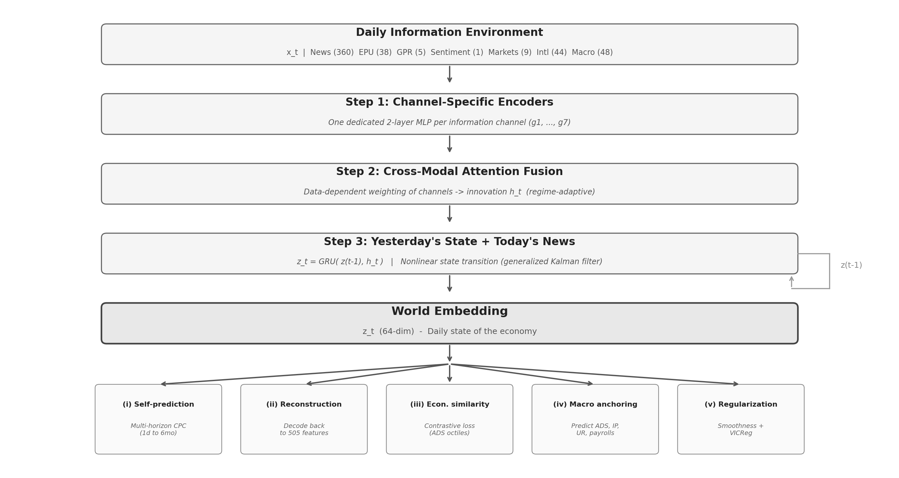

# *World Embedding*

**Word2Vec maps words to vectors where semantic relationships become geometric regularities. The *world embedding* does the same for trading days: it maps each day to a vector where economic similarity is encoded as distance in a learned space.**

On any given day, investors, policymakers, and researchers confront an information environment of extraordinary breadth - macroeconomic releases, central-bank communications, geopolitical developments, asset prices, and a continuous stream of news narratives - yet the profession still measures the aggregate economic state with a handful of single-domain proxies: VIX for volatility, EPU for policy uncertainty, ADS for real activity, credit spreads for default risk. Each sees one slice. Researchers stack them in ad hoc specifications, accepting frequency mismatches, degrees-of-freedom costs, and linear aggregation that misses the nonlinear amplification characteristic of crises.

The ***world embedding*** replaces that patchwork with a single object. It compresses **505 daily features spanning seven information modalities** - news narratives, economic policy uncertainty, geopolitical risk, news sentiment, domestic financial markets, international markets and FX, and macroeconomic indicators - into one **64-dimensional vector per U.S. business day**. No other publicly available measure jointly covers this breadth at daily frequency. The result is a compact, multimodal summary of the economic state that captures what the standard proxies capture individually, plus the cross-modal dynamics they miss.

The model is trained under a strict **expanding-window protocol**: the vector for day *t* uses only information available through day *t*, with no look-ahead bias. Training and out-of-sample evaluation cover **January 2, 1985 through December 29, 2017**. A pseudo-out-of-sample extension through **June 30, 2021** - with all model parameters frozen at their December 2017 values - demonstrates robustness across the Covid-19 crisis without any retraining. The full sample of **9,520 pre-computed daily vectors** is released here and can be merged into any dataset in three lines of code. No GPU, no deep-learning expertise, no retraining required.

[](https://papers.ssrn.com/abstract=6503446)
[](LICENSE)
[](https://www.python.org/downloads/)
[](https://elittb.github.io/world-embedding/)

## Author

[Elham Tabatabaei](https://www.elhamtabatabaei.com/)

## Academic Paper

The full methodology and results are detailed in:

**[World Embedding: The Daily Economic State and Bond Risk Premia](https://papers.ssrn.com/abstract=6503446)**

If you use this data or methodology in your research, please cite the paper:

```bibtex
@article{Tabatabaei2026WorldEmbedding,
  title   = {World Embedding: The Daily Economic State and Bond Risk Premia},
  author  = {Tabatabaei, Elham},
  year    = {2026},
  journal = {SSRN Working Paper},
  number  = {6503446},
  url     = {https://papers.ssrn.com/abstract=6503446}
}
```

---

## Key Features

1. **Pre-computed daily vectors.** 9,520 business days (1985-2021) of 64-dimensional embedding vectors, ready to download as a CSV and merge into any dataset in three lines of code.
2. **Seven information modalities.** News narratives, economic policy uncertainty, geopolitical risk, news sentiment, domestic financial markets, international markets and FX, and macroeconomic indicators - all compressed into a single vector per day.
3. **Look-ahead-free.** Trained under a strict expanding-window protocol. The embedding for day *t* uses only information available through day *t*.
4. **Validated against known benchmarks.** Out-of-sample correlation of 0.50 with the ADS Business Conditions Index (not used in training). Unsupervised clustering recovers NBER recessions with 13-26x higher alignment than linear PCA.
5. **Bond risk premia.** Embedding principal components raise out-of-sample R-squared for bond excess returns by 10-34 percentage points beyond yield-curve factors.
6. **Near-zero equity return prediction.** The embedding does not predict stock returns, confirming it captures the economic state rather than exploitable return patterns.
7. **Covid-robust.** With all parameters frozen at December 2017, the embedding tracks the 2020 contraction and recovery without retraining.
8. **Pre-trained weights included.** All model weights for the three expanding windows and the full-sample reference model are available under [Releases](https://github.com/elittb/world-embedding/releases), along with hyperparameters and normalization statistics, so you can load the trained model directly without retraining.
9. **Pip-installable.** Available as a Python package with convenience functions for loading embeddings, extracting principal components, and accessing regime labels.

---

## Quick Start

### Option 1: Just use the pre-computed daily vectors (no ML needed)

Download the CSV and add embedding principal components to your regressions:

```python
import pandas as pd
from sklearn.decomposition import PCA

# Load pre-computed daily embeddings (see Data Periods for train/test/simulation splits)
df = pd.read_csv("data/world_embedding_daily.csv", parse_dates=["date"], index_col="date")

# Extract first 5 principal components
pca = PCA(n_components=5)
epc = pd.DataFrame(
    pca.fit_transform(df.values),
    index=df.index,
    columns=[f"EPC{i+1}" for i in range(5)],
)

# Merge into your dataset
your_data = your_data.merge(epc, left_index=True, right_index=True, how="left")
```

### Option 2: Install as a Python package

```bash
pip install git+https://github.com/elittb/world-embedding.git
```

```python
from worldembedding import load_embedding, load_regime_labels

# Daily 64-dim embedding vectors (pandas DataFrame)
emb = load_embedding()

# Unsupervised regime labels (16 VQ codes)
regimes = load_regime_labels()

# Principal components (convenience function)
from worldembedding import get_principal_components
epc = get_principal_components(n_components=5)
```

---

## Project Structure

```
world-embedding/
├── README.md                           # This file
├── CITATION.cff                        # GitHub "Cite this repository" metadata
├── LICENSE                             # MIT license
├── pyproject.toml                      # Package build configuration
├── data/
│   ├── world_embedding_daily.csv       # Pre-computed 64-dim daily vectors (9,520 days)
│   ├── world_embedding_regime_labels.csv   # Unsupervised regime labels (16 codes)
│   └── README.md                       # Data documentation and period details
├── worldembedding/                     # Pip-installable Python package
│   ├── __init__.py
│   ├── core.py                         # load_embedding(), get_principal_components()
│   └── model/                          # Full DSSDE architecture (for advanced users)
│       ├── dssde.py                    # Main model class
│       ├── encoder.py                  # Modality encoders, cross-modal attention, GRU
│       ├── decoder.py                  # Observation reconstruction decoder
│       ├── loss.py                     # Composite loss (CPC, reconstruction, contrastive)
│       └── vq.py                       # Vector quantization for regime discovery
├── examples/
│   ├── quickstart.py                   # 30-line demo: load, PCA, historical analogs
│   ├── bond_spanning.py                # Replicate the spanning puzzle result
│   └── regime_analysis.py             # Unsupervised recession detection
├── replication/                        # Full training and evaluation pipeline
│   ├── config.py                       # All hyperparameters (DSSConfig dataclass)
│   ├── train.py                        # Training loop with expanding-window protocol
│   ├── evaluate.py                     # Evaluation suite (nowcasting, regime, forecasting)
│   ├── expanding_windows.py            # W1/W2/W3 window definitions
│   ├── data/
│   │   ├── download_all.py             # Bulk data download (FRED, Yahoo, etc.)
│   │   └── assemble.py                 # Feature panel assembly
│   └── model/                          # Model code (mirrors worldembedding/model/)
├── scripts/
│   ├── spanning_puzzle.py              # Bond spanning regressions (Tables 5-8)
│   ├── covid_era_extension.py          # FAVAR simulation + pseudo-OOS (Section 7)
│   ├── historical_analog_case_study.py # Cosine similarity retrieval (Table 4)
│   └── plot_regime_tsne.py             # t-SNE visualization (Figure 4)
└── docs/
    ├── index.html                      # Landing page for GitHub Pages / SEO
    └── SEARCH_CONSOLE.md               # Google Search Console setup guide
```

---

## Research Applications

| Application | How to use |
|---|---|
| **Event studies** | Control for aggregate state using EPC1-EPC5 instead of ad hoc market-return or VIX controls |
| **Asset pricing tests** | Replace separate VIX + term spread + credit spread controls with a single parsimonious set of embedding PCs |
| **Bond return prediction** | Embedding PCs capture unspanned macro risks beyond yield-curve factors |
| **Regime classification** | Use VQ regime labels or k-means on the embedding for data-driven expansion/recession classification |
| **Macro forecasting** | Embedding carries incremental information for labor-market indicators in crisis periods |
| **Historical analogs** | Cosine similarity retrieval: find the most economically similar days across decades |

---

## Data Periods

The embedding CSV contains **9,520 business days** spanning three distinct periods:

| Period | Dates | Status | News data | All other modalities |
|--------|-------|--------|-----------|---------------------|
| **Training & OOS test** | 1985-01-02 to 2017-12-29 | Model trained and evaluated with expanding-window protocol | Actual (Bybee et al. WSJ topics) | Actual |
| **Pseudo-OOS extension** | 2018-01-02 to 2021-06-30 | All model parameters **frozen** at Dec 2017 values; no retraining | **FAVAR-simulated** (see paper Section 7) | Actual |

Within the training period (1985-2017), three expanding windows are used for out-of-sample evaluation:

| Window | Train | Out-of-sample test |
|--------|-------|--------------------|
| W1 | 1985-2000 | 2001-2005 |
| W2 | 1985-2005 | 2006-2011 |
| W3 | 1985-2011 | 2012-2017 |

**Important:** For the 2018-2021 extension, news narratives (360 of 505 features) are FAVAR-simulated from the historical relationship between news topics and observed market/macro data. The remaining six modalities use actual observed data. See Section 7 of the [paper](https://papers.ssrn.com/abstract=6503446) for full details.

---

## Data Coverage

| Modality | Features | Source |
|----------|----------|--------|
| News narratives | 360 | Bybee et al. (2024) WSJ topic attention |
| Policy uncertainty | 38 | Baker, Bloom & Davis (2016) EPU |
| Geopolitical risk | 5 | Caldara & Iacoviello (2022) GPR |
| News sentiment | 1 | SF Fed Daily News Sentiment |
| Domestic markets | 9 | Yahoo Finance (SPY, VIX, Treasury, commodities, USD) |
| International | 44 | Yahoo Finance + FRED (equities, FX, commodities) |
| Macro indicators | 48 | FRED (yields, spreads, conditions, labor, housing) |
| **Total** | **505** | |

---

## Model Architecture (DSSDE)

The Daily State-Space Deep Embedding implements a simple economic principle: **today's state = yesterday's state + today's news.**

```
                                               Cross-Modal
  News (360) ---> [ Encoder 1 ] ---+          +-----------+         +-------+
  EPU  (38)  ---> [ Encoder 2 ] ---+          |           |         |       |
  GPR  (5)   ---> [ Encoder 3 ] ---+          |  Attention|         |  GRU  |
  Sent (1)   ---> [ Encoder 4 ] ---+--------> |           |-------> |       |---> z_t
  Mkt  (9)   ---> [ Encoder 5 ] ---+          |   Fusion  |         |       |    (64-dim)
  Intl (44)  ---> [ Encoder 6 ] ---+          |           |         +---+---+
  Macro(48)  ---> [ Encoder 7 ] ---+          +-----------+             |
                                                                   z_{t-1}
```

<p align="center">
  
</p>

**Econometric analog:** The architecture is a nonlinear state-space model. The encoders + attention = nonlinear observation equation. The GRU = nonlinear state transition (generalized Kalman filter). The expanding-window protocol = real-time econometric discipline.

See the [paper](https://papers.ssrn.com/abstract=6503446) for full details.

---

## Installation & Requirements

### Using the pre-computed data only

```bash
pip install pandas scikit-learn
```

No GPU, no PyTorch, no ML expertise required. Download the CSV and go.

### Installing the full package

```bash
pip install git+https://github.com/elittb/world-embedding.git
```

### Replication (training from scratch)

```bash
git clone https://github.com/elittb/world-embedding.git
cd world-embedding
pip install -e ".[replication]"
```

**Python version:** 3.9+

**Core dependencies:** `pandas>=2.0`, `numpy>=1.24`, `scikit-learn>=1.3`

**Replication dependencies (optional):** `torch>=2.0`, `matplotlib>=3.7`, `seaborn>=0.12`, `yfinance>=0.2.31`, `fredapi>=0.5.1`, `statsmodels>=0.14`

---

## Replication

To replicate the paper results from scratch:

```bash
# 1. Download raw data (requires FRED API key)
export FRED_API_KEY="your_key_here"
python -m replication.data.download_all

# 2. Assemble feature panel
python -m replication.data.assemble

# 3. Train (expanding-window protocol; ~2-4 hours on GPU)
python -m replication.train journal

# 4. Evaluate
python -m replication.evaluate journal
```

Pre-trained model weights for all three expanding windows and the reference model are available under [Releases](https://github.com/elittb/world-embedding/releases).

---

## Validation & Robustness

The embedding is evaluated through multiple independent tests, all reported in the [paper](https://papers.ssrn.com/abstract=6503446):

| Test | Result |
|------|--------|
| **ADS correlation** | Out-of-sample correlation of 0.50 with the Aruoba-Diebold-Scotti Business Conditions Index, which is never used in training |
| **NBER recession recovery** | Unsupervised k-means clustering on the embedding recovers NBER recession dates with 13-26x higher alignment than linear PCA on the same inputs |
| **Bond excess returns** | Embedding PCs raise out-of-sample R-squared for 2- through 5-year bond excess returns by 10-34 percentage points beyond yield-curve factors alone |
| **Clark-West tests** | Statistically significant at the 1% level for all maturities at the annual forecast horizon, rejecting equal predictive ability against the yield-only benchmark |
| **Giacomini-White tests** | Confirm superior conditional predictive ability of the embedding-augmented model across expansion and recession subsamples |
| **Equity return prediction** | Near-zero out-of-sample R-squared for equity excess returns, confirming the embedding measures the economic state rather than exploitable return patterns |
| **Covid-19 pseudo-OOS** | With all parameters frozen at December 2017, the embedding tracks the 2020 contraction and recovery as the largest displacement in its 36-year history - no retraining, no parameter updating |
| **Macro nowcasting** | Real-time ADS nowcasting from the embedding achieves positive out-of-sample R-squared during crisis periods when standard models deteriorate |

---

## Contributing

Contributions that extend the *world embedding* or apply it to new settings are welcome. Areas of particular interest include:

- **Temporal extension.** Updating the embedding beyond June 2021 as new data becomes available
- **Additional modalities.** Integrating new data sources (e.g., social media sentiment, satellite imagery, earnings call transcripts) as input features
- **Cross-country versions.** Adapting the architecture to produce daily state embeddings for non-U.S. economies
- **Alternative architectures.** Experimenting with Transformer-based or diffusion-based state transition models in place of the GRU
- **New applications.** Using the embedding in settings beyond bond pricing and macro forecasting (e.g., corporate event studies, credit risk, portfolio construction)
- **Benchmark comparisons.** Evaluating the embedding against other state measures or dimensionality reduction methods on standardized tasks

To contribute, please open an [issue](https://github.com/elittb/world-embedding/issues) or submit a pull request. If you use the embedding in a published study, a citation to the [paper](https://papers.ssrn.com/abstract=6503446) is appreciated.

---

## License

This project is licensed under the MIT License. See [LICENSE](LICENSE) for details.

The pre-computed embedding vectors in `data/` are released under [CC BY 4.0](https://creativecommons.org/licenses/by/4.0/), meaning you can use them freely with attribution.

---

## Contact

**[Elham Tabatabaei](https://www.elhamtabatabaei.com/)** · [ORCID](https://orcid.org/0000-0002-9208-1105)

PhD Candidate, Schulich School of Business, York University;
Visiting Scholar, Rady School of Management, UC San Diego

Email: [elliettb@schulich.yorku.ca](mailto:elliettb@schulich.yorku.ca) · [setabatabaei@ucsd.edu](mailto:setabatabaei@ucsd.edu)
